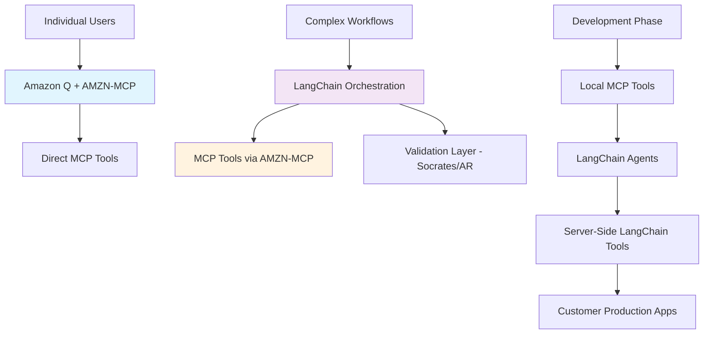

# Amazon MCP Strategy Discussion - Sergio & Doug Collaboration

**Date:** June 3, 2025  
**Participants:** Sergio Ibagy, Doug Hains  
**Context:** Renato asked both to work on Amazon's "MCP story"

## 🎯 Core Challenge

Amazon lacks **remote MCP servers**, limiting MCP usage in customer-facing applications. Current MCP requires local installation, making it impractical for production deployments.

## 🔄 Two Distinct Use Cases Identified

### Use Case 1: Direct MCP Queries (Sergio's Focus)
- **Pattern:** `LLM → MCP CALL → MCP PROCESSING → RETURN TO LLM`
- **Example:** PM using Q CLI: "What is current allocation for weblab XYZ?"
- **Target Users:** Individual developers, PMs via Amazon Q
- **Solution:** AMZN-MCP integration with Amazon Q

### Use Case 2: Orchestrated Workflows (Doug's Focus)  
- **Pattern:** Complex multi-step processes with deterministic control
- **Examples:** WLBR write-ups, SIP integration, automated code rollouts
- **Challenge:** Need guaranteed step execution, not just LLM suggestions
- **Current Approach:** LangChain for orchestration + MCP for tools

#### investigation
- [[llm-langchain-investigation]]
- [[llm-lanchain-where-does-it-fit]]

## 🛠️ Technology Stack Discussion

### MCP (Model Context Protocol)
- **Primary Focus:** Tool exposure and Amazon-internal integration
- **Target:** AMZN-MCP as first step
- **Integration:** Amazon Q will ship with AMZN-MCP installed
- **Builder Tools:** Working on Amazon-wide enablement

### LangChain Role Clarification
- **NOT for:** Tool building (MCP handles this)
- **FOR:** Orchestration and deterministic workflow control
- **Key Insight:** Provides abstraction layer between manual coding and full LLM autonomy
- **Real Usage:** SIP team using LangChain + MCP with good results

### Validation Technologies
- **Socrates:** Amazon AR technology for response validation
- **SPARC/BMAD:** Frameworks for agent personas (Sergio's experience)
- **GenAI Power Users:** Natural language scripts (limited determinism)

## 🏗️ Proposed Architecture

## 📋 Action Plan

### Phase 1: MCP Foundation (Immediate)
- [ ] Focus on AMZN-MCP tool exposure
- [ ] Stop "need weblab" requests through proper MCP integration
- [ ] Collaborate on tool development for AMZN-MCP

### Phase 2: Orchestration Layer (Future)
- [ ] Evaluate LangChain for complex workflows
- [ ] Integrate Socrates for validation
- [ ] Build deterministic process blocks

### Phase 3: Production Bridge (Long-term)
- [ ] Wait for Amazon remote MCP servers
- [ ] Migrate LangChain server-side tools if needed

## 🤝 Collaboration Details

### Team Connections
- **SIP Team:** Using LangChain + MCP for automated code rollouts
- **Builder Tools:** Working on Amazon-wide MCP enablement
- **Search Team:** Joint goals with Doug's team

### Meeting Planned
- **When:** Thursday (Doug free all day, Sergio available anytime)
- **Focus:** Jump-start MCP work
- **Prep:** Sergio reading LangChain documentation

### Work Styles
- **Sergio:** 6am-3pm with Renato, deterministic CS examples
- **Doug:** Multiple priorities, TypeScript/Python orchestration like Yakub

## 🔑 Key Insights

1. **MCP First:** Both agree MCP tool exposure is the foundation
2. **Different Needs:** Simple queries vs. complex orchestration require different approaches  
3. **LangChain Clarification:** Not for tool building, but for workflow orchestration
4. **Validation Critical:** Determinism requires AR/validation layer
5. **Phased Approach:** Start with MCP, add orchestration as needed

## 📚 References

- **GenAI Power Users:** [weblab-reviewer script](https://code.amazon.com/packages/AmazonBuilderGenAIPowerUsersQContext/blobs/mainline/--/scripts/weblab-reviewer.script.md)
- **Workflow Examples:** [Cline bot workflows](https://docs.cline.bot/features/slash-commands/workflows#real-world-example)
- **Socrates AR:** [Amazon ARG Socrates](https://w.amazon.com/bin/view/ARG/Socrates)

---

*Tags: #MCP #LangChain #Amazon #Orchestration #AI-Tools #Collaboration*