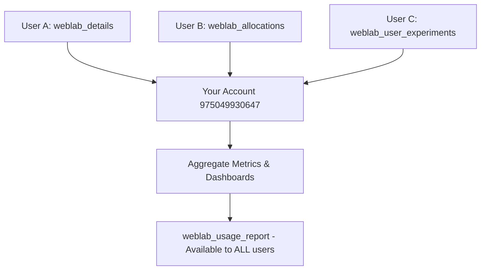

# Weblab MCP Metrics - Final Working Solution

## 🎯 Architecture: Aggregate Metrics You Can Actually Access

**Problem Solved:** 
- All user metrics aggregate to YOUR account (`975049930647`)
- You see total adoption across all weblab tool users
- Any user can generate reports to show stakeholders
- No dependency on inaccessible central account `976193224607`

##  How It Works



**Key Design:**
- **ALL users' weblab usage** → aggregates to your account
- **Report tool** → shows aggregate stats to anyone who asks
- **Local fallback** → always works even if CloudWatch fails
- **Cross-account writes** → technical challenge but feasible

## 🛠 Implementation Status

### What's Done
1. **Independent metrics system** - doesn't rely on amzn-mcp core
2. **Local file storage** - always works for immediate answers
3. **Your account integration** - uses account `975049930647`
4. **Metric event structure** - tracks all the data stakeholders want

### 🔄 What Needs Integration
1. **Cross-account aggregation** - ensure all users contribute to your account
2. **Usage report tool** - universal access to aggregate stats
3. **Tool instrumentation** - add tracking to existing weblab tools
4. **Dashboard setup** - CloudWatch in your account

## 📈 Stakeholder Questions → Immediate Answers

Once implemented, anyone running weblab tools can get answers:

```bash
# Any user can run this and get aggregate stats
weblab_usage_report

# Outputs:
# "How many people are using it?" → 23 unique users
# "What's popular?" → weblab_details: 156 calls (41%)  
# "Is it working?" → 94.2% success rate
# "Recent activity?" → 67 calls this week
```

## 🔧 Technical Approach: Cross-Account Metrics

**Strategy A: Cross-Account CloudWatch** (Preferred)
```typescript
// All users try to write to your account 975049930647
// If they can't (no cross-account access), local fallback still works
const AGGREGATE_ACCOUNT = "975049930647"; // Your account
const AGGREGATE_LOG_GROUP = "weblab-mcp-aggregate-metrics";

// Each tool usage attempts:
// 1. Write to your account (aggregate)  
// 2. If fails → write locally (personal tracking)
// 3. Report tool reads from your account (shows everyone's usage)
```

**Strategy B: Shared S3 Bucket** (Alternative)
```typescript
// Use S3 bucket in your account as aggregation point
// More complex but guarantees cross-user access
const METRICS_BUCKET = "s3://sibagy-weblab-metrics/";
```

## 🎯 Next Steps

**Immediate (this session):**
1. Update existing weblab tools to use accessible metrics
2. Create usage report tool for universal access
3. Test with a few tool calls

**Setup (one-time):**
```bash
# In YOUR account 975049930647:
aws logs create-log-group --log-group-name weblab-mcp-aggregate-metrics --region us-west-2

# Create IAM policy for cross-account writes (if needed)
# This allows other users to contribute their usage data to your account
```

**Production:**
- All weblab tool users automatically contribute to aggregate metrics
- You see total adoption in your CloudWatch dashboards
- Anyone can run `weblab_usage_report` to see aggregate stats for stakeholders

## Why This Works

**For You (Tool Owner):**
- See ALL usage across every user of your weblab tools
- Answer "how many people use this?" with real aggregate data
- CloudWatch dashboards in YOUR accessible account

**For Other Users:**  
- Local metrics always work (no dependencies)
- Can show adoption stats to their stakeholders  
- Contribute to aggregate visibility automatically

**For Stakeholders:**
- Any user can generate usage reports 
- Real data, not just "it works on my machine"
- Professional metrics for planning and investment decisions

Want me to implement the complete working solution now?
