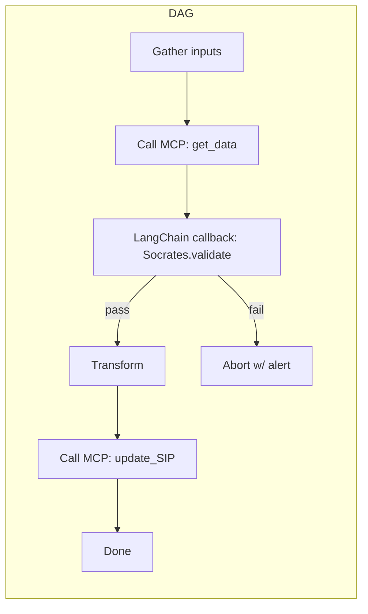

### Where LangChain Fits – Practical Ideas for the Sergio & Doug Plan

---

#### 1 ️⃣ Use-case heat-map

| Need                                                            | Local dev                                              | Internal power users                                               | Customer-facing prod                                                                                                                         |
| --------------------------------------------------------------- | ------------------------------------------------------ | ------------------------------------------------------------------ | -------------------------------------------------------------------------------------------------------------------------------------------- |
| **Ad-hoc Q CLI queries**<br>“LLM → single tool → answer”        | Plain MCP server over `stdio`                          | Amazon Q already bundles **AMZN-MCP** (good)                       | **No remote MCP yet** → run that same tool **via LangChain’s MCP adapter** behind an API gateway so prod can call it                         |
| **Deterministic multi-step workflows**<br>(WLBR, SIP roll-outs) | LangGraph DAG in your notebook calling local MCP tools | LangGraph service in a VPC calling **internal** MCP micro-services | Same DAG deployed as a **serverless LangChain service**; tools are the same MCP micro-services, now publicly reachable through an edge proxy |

*Why LangChain?*
It’s **not** the tool runtime (MCP owns that). It’s the **glue** that lets an LLM decide **when / how / in what order** to call those tools – plus strong DAG controls (LangGraph) for deterministic flows.

---

#### 2 ️⃣ Prototype → Prod flow

```text
┌──────────────┐      ┌────────────────┐
│ dev laptop   │──►──►│  LangGraph DAG │──► Tools via MCP (stdio)
└──────────────┘      └────────────────┘           ▲
        │ env=DEV                       same code  │
        ▼                                          │
┌──────────────────────── prod ─────────────────────┐
│  ECS/Fargate / Lambda running same LangGraph DAG  │
│        │                                          │
│        ├──► internal VPC MCP servers (WLBR, SIP)  │
│        └──► public MCP servers (search, weather)  │
└────────────────────────────────────────────────────┘
```

*Single codebase, config-driven endpoints*

```python
from langchain_mcp_adapters import MultiServerMCPClient
import os

MCP_CFG = {
    "wlbr": dict(
        url=os.getenv("WLBR_URL"),          # http://wlbr.prod:9000/mcp in prod
        transport="streamable_http",        # stdio in dev
    ),
    "sip": dict(
        command="python", args=["sip_server.py"], transport="stdio"
    ),
}
client = MultiServerMCPClient(MCP_CFG)
tools  = await client.get_tools()
```

The *agent logic* never changes—only the endpoints.

---

#### 3 ️⃣ Wiring LangChain into each phase

| Phase                 | What LangChain gives you                                                                                                                             | Quick win                                                                                   |
| --------------------- | ---------------------------------------------------------------------------------------------------------------------------------------------------- | ------------------------------------------------------------------------------------------- |
| **Local PoC**         | Spin up LangGraph DAGs that launch MCP servers as subprocesses. Hot-reload chains while hacking.                                                     | Have Doug convert one WLBR script into an MCP server, wire it into a LangGraph ReAct agent. |
| **Internal dog-food** | Run that DAG as a **FastAPI** service.  Add Socrates **validation** node after every tool call (`validate_output` tool).                             | Showcase to SIP team – they already use LangChain, so unify patterns.                       |
| **Customer prod**     | Wrap the same DAG in Lambda / ECS task.  Tools move to **HTTP MCP micro-services** (stateless, auto-scalable).  Add API-key auth in the MCP gateway. | Release limited-beta feature in Amazon Q that routes “complex ask” to this DAG.             |

---

#### 4 ️⃣ Deterministic orchestration pattern (Doug’s focus)



*Why DAG not plain ReAct?*

* **Edges explicit** → guarantees every step runs (or aborts) exactly once.
* **Replayable**: store each node’s input/output for audit.
* **Easy AR hooks**: Socrates or BMAD sits on validation edges.

---

#### 5 ️⃣ Bridge for “no remote MCP yet”

1. **Containerise each high-value tool** (WLBR, SIP, weblab stats) as a tiny MCP HTTP server.
2. **Deploy behind an internal ALB** (still “remote” from the LangChain service, but inside the VPC).
3. **Expose only those endpoints needed by the prod agent** – keeps blast-radius small until the real Amazon MCP gateway lands.
4. When AMZN launches the official remote MCP, flip the URLs in `MCP_CFG`. Zero code change.

---

#### 6 ️⃣ Next steps for Thursday meeting

* **Pick one real workflow** (WLBR) and build:

  * 🔹 *Tool*: wrap WLBR SQL/report logic as MCP server.
  * 🔹 *Agent*: 4-node LangGraph with Socrates validation.
* **Decide hosting**: Lambda vs ECS Fargate.  Baseline: \~500 ms tool latency OK → Lambda; else ECS.
* **Auth story**: start with IAM-based mTLS between LangChain service and MCP servers.
* **Observability**: enable LangSmith traces + CloudWatch for tool RTT.

---

#### 7 ️⃣ Why this matters

* **One abstraction across Amazon** – devs keep hacking locally with MCP; customers get stable, secure services.
* **Swap-in future infra** – when Amazon’s remote MCP arrives, LangChain layer **stays**: just point to the new host.
* **Shared patterns** – SIP, WLBR, any team can publish a tool; agents pick it up automatically.
* **Determinism without hand-coding** – LangGraph DAGs + Socrates guard-rails give you “run it like a script” reliability with LLM flexibility.

