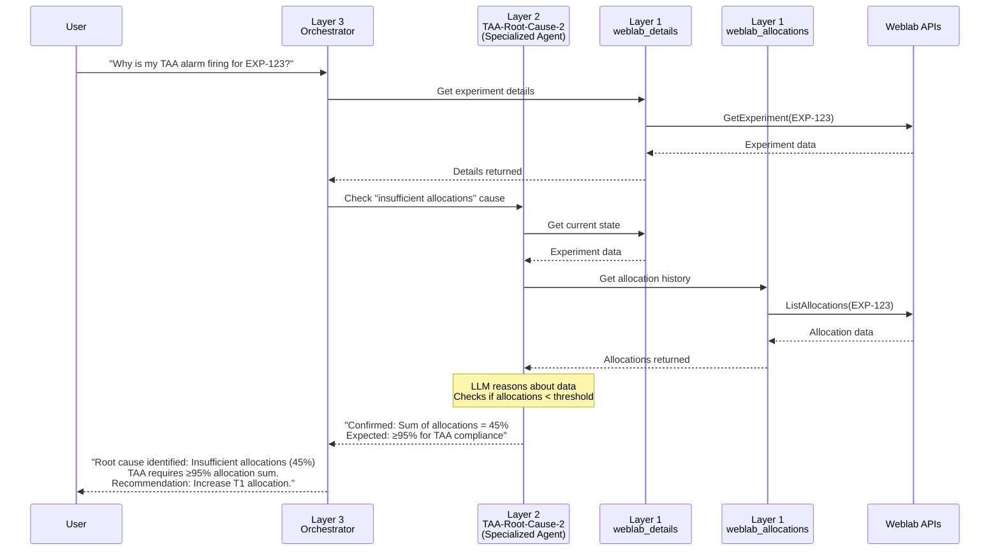

# MCP/AI Technical Vision

**Owner:** Sergio Ibagy (with support from Doug, YJ, Arpit)  
**Date:** October 10, 2025  
**Purpose:** Input for Weblab 3YAP - Technical architecture and implementation approach for MCP/AI  
**Deadline:** October 20, 2025

---

## Safety-First Constraint (2025)

**CRITICAL: READ-ONLY FOR 2025**

> "We're doing MCP but for 2025 it is read-only to protect the safety of the control plane."  
> — William Josephson, PE (October 9, 2025)

**Technical Implications:**
- 2025 tools: Read-only operations (GetExperiment, ListAllocations, query data)
- 2026+ tools: Write operations (CreateExperiment, UpdateAllocation, dial-up)
- Architecture supports both, but access controls limit to read-only initially
- Safety measures and monitoring required before enabling write capabilities

**Why This Matters:**
- Weblab is tier-1 service with 125+ client dependencies
- Control plane availability non-negotiable
- Gradual rollout reduces risk
- Prove architecture safety before adding write operations

**Reference:** [James/William Safety Thread](../../threads/james-william-mcp-safety-thread.md)


---

## Purpose of This Doc

Technical architecture covering:
- Current architecture and what we've built
- Problems with original approach
- Proposed solutions and trade-offs
- 3-year technical evolution
- Open technical debates

---

## Existing Architecture (Phase 1 - What We Built)

### Current State: 3 Working MCP Tools

```
User's Machine (Q CLI, Cline)
    ↓ stdio
amzn-mcp (Local Server)
    ↓ Tool calls
Weblab MCP Tools (TypeScript)
    ├─ weblab_details → GetExperiment API
    ├─ weblab_allocations → ListAllocations API
    └─ weblab_activation_history → ListAllocationPeriods API
         ↓ HTTP + Midway Auth
    Weblab APIs (WeblabAPIModel)
```

**What works:**
- All 3 tools tested with Vignesh (director demo)
- 2179 tests passing
- Dual authentication (Midway + Weblab API keys)
- BETA and PROD environment support
- Integration with andes-mcp for Andes SQL queries

**Technical achievements:**
- Proper API authentication (not page scraping)
- Tool discovery and parameter validation
- Error handling and rate limiting
- BYOK support for team-specific keys

### Other Tools Built (Archived - Untested)

**Experimental tools we won't migrate:**
- `weblab_user_experiments` - Andes SQL queries
- `weblab_request_andes_access` - Auto permission requests
- `weblab_health_check` - Metrics monitoring

**Why archived:** Remote Strands agent handles these better (see below)

---

## Problems and Issues

### Problem 1: Local Fork Violates MCP Everywhere Mandate

**Discovery (Oct 2):** MCP CCI has mandatory "Remote-First Architecture" requirement

**Impact:**
- Our September fork plan = **non-compliant**
- Local stdio servers don't meet CCI bar
- amzn-mcp deprecating by end of October anyway
- Chetan rejected merge request

**Quote from mandate:**
> "Remote Agent-first / Remote MCPServer-first approach - A remote-MCP server is easily scalable and shareable."

**Why this matters:**
- WSS has 125 clients → Must-Do status
- Q1 2026 deadline (P0)
- Can't proceed with non-compliant architecture

### Problem 2: Scalability and Share-ability

**Current limitations:**
- One local server per user
- Can't share agents across org
- No centralized rate limiting or metrics
- Each user needs local setup

**Production needs:**
- Shared infrastructure
- Consistent behavior across users
- Centralized monitoring and control
- Cost optimization

### Problem 3: Authentication Complexity in Local Model

**Current auth:**
- User's Midway token for API calls
- Works for individual users
- Doesn't scale for service-to-service

**Missing:**
- Service identity (CloudAuth)
- Transitive Auth for user delegation
- Proper audit trails ("who called this?")

### Problem 4: Observability Gaps

**Current:**
- Custom metrics implementation (accessible-metrics.ts)
- No distributed tracing
- Can't correlate user query → tool calls → API responses
- Hard to debug agent reasoning

**Need:**
- OpenTelemetry for traces
- CloudWatch for standard metrics
- Cost tracking (token usage)
- Conversation logging

---

## Hotly Debated Topics

### Debate 1: Fork amzn-mcp vs Build Remote Server

**On one hand (September thinking):**
- Fork amzn-mcp, clean it up, team ownership
- Reuse existing auth patterns (Midway already works)
- Faster to market (1-2 weeks)
- Lower complexity

**On the other hand (October reality):**
- Violates remote-first mandate
- amzn-mcp deprecating anyway
- Local architecture doesn't scale
- Must build remote anyway for compliance

**Resolution:** Remote Strands agent (see below)

### Debate 2: Custom Remote Server vs AmazonMCPGateway

**AmazonMCPGateway (existing solution):**
- Pros: Already exists, maintained by Coral team, MCP Registry integration
- Cons: Designed for Coral services, Transitive Auth limitations, less control

**Custom Remote Server (Strands agent):**
- Pros: Full control, agent orchestration, optimized for weblab
- Cons: More to build and maintain, higher complexity

**Current thinking:** 
- Strands agent preferred (see reasons below)
- But investigate MCPGateway as fallback
- Need guidance from MCP Everywhere team

### Debate 3: Redshift vs Athena for Data Access

**Redshift cluster (Kevin's recommendation):**
- Pros: Proven, scalable (adjust compute), has CDK patterns
- Cons: Infrastructure costs, need to maintain cluster

**Athena MCP server (via andes-mcp):**
- Pros: No infrastructure, uses existing andes-mcp, auto-approved access
- Cons: Dependent on andes-mcp availability, less control

**Current thinking:**
- Start with Redshift (proven)
- YJ to investigate Athena costs
- Arpit to explore andes-mcp integration
- Decision by Nov 2025

### Debate 4: Language Choice (TypeScript vs Python)

**TypeScript (Phase 1):**
- Pros: Existing tools in TS, amzn-mcp patterns
- Cons: Limited agent frameworks, would need custom MCP server implementation

**Python (Strands):**
- Pros: Strands SDK, Doug's patterns, OpenTelemetry built-in, AWS internal adoption
- Cons: Rewrite tools from TS, team learning curve

**Current thinking:** Python/Strands wins because:
- Native MCP support (MCPClient + can BE MCP server)
- Doug's production patterns available
- Agent orchestration beyond simple tools
- Better observability story

---

## New Architecture (Remote Strands Agent)

### Agentic Behavior Requirements

**AWS's Definition of AI Agents:**

> An AI agent is a system that can perceive, reason, act, and learn to achieve goals. These systems don't just vary in performance and ability, but also their behavior towards a user. In an agentic experience, the system doesn't wait passively for input. Instead, it participates, collaborates, and acts on behalf of the user when appropriate, and it knows when not to.

**Source:** AWS Cloudscape Design System, October 2, 2025

**Strands Agent Architecture Enables True Agentic Behavior:**

- **Perceive:** Understands user goals from natural language queries
- **Reason:** LLM decides which tools to use, in what order, based on context
- **Act:** Executes multi-step workflows autonomously (orchestration)
- **Learn:** Adapts based on conversation context, feedback, session history

**Example Agentic Flow:**
```
User: "Find Dave's weblabs with positive CP impact"

Agent Perceives: Complex analytical question needing multiple data sources
Agent Reasons: Need to (1) find Dave's weblabs, (2) check results, (3) filter CP
Agent Acts: Orchestrates tools autonomously
  1. Query Andes for experiments where owner='Dave'
  2. For each, call weblab_details to get metadata
  3. Query Andes for CP metrics per experiment
  4. Filter and synthesize results
Agent Learns: Remembers Dave's experiments for follow-up queries

Result: Natural language answer with synthesized insights
```

**This distinguishes our approach from:**
- Chat UI with decision tree (not reasoning)
- LLM without goals (no orchestration)
- Opaque automation (no transparency)

### Why Strands Agent

**Key insight from investigation:**
> Strands agents ARE remote architecture. They're designed to be deployed as Lambda/Fargate services, not local processes.

**Architecture:**
```
User's Machine (Q CLI, Cline, etc.)
    ↓ Remote MCP protocol (OAuth bearer tokens)
WeblabStrandsAgent (Lambda - REMOTE!)
    ├─ MCP Protocol Endpoint
    │  └─ Handles MCP list/call operations
    ├─ Strands Agent Core
    │  └─ LLM + tools + orchestration
    ├─ Weblab Tools (migrated from Phase 1)
    │  ├─ @tool weblab_details
    │  ├─ @tool weblab_allocations
    │  └─ @tool weblab_activation_history
    └─ Observability (OpenTelemetry)
         ↓ CloudAuth + Transitive Auth
    Weblab APIs (WeblabAPIModel)
         ↓ (optional) Remote MCP
    Andes MCP Server (for complex SQL)
```

**Key properties:**
- Remote-first compliant
- Scalable (Lambda auto-scaling)
- Shareable (org-wide access)
- MCP native (Strands SDK support)
- Production-ready (Doug's patterns)

### Technical Benefits

**1. Reuses Phase 1 Work:**
- 90% of API logic portable
- Authentication patterns understood
- Tool schemas validated
- Test cases reusable

**2. Agent Orchestration:**
```python
# User asks complex question
"What weblabs did Dave launch that had positive CP impact?"

# Agent orchestrates multiple tools:
1. Call weblab_user_experiments(owner="dave")
2. For each experiment, call weblab_details()
3. Filter by has_results=true
4. Query Andes for CP metrics
5. Synthesize answer

# User gets: Natural language answer with data
```

**3. Observability Built-in:**
- OpenTelemetry traces entire flow
- Original NL request preserved
- Tool execution visible
- Cost tracking automatic
- Conversation logging for debugging

**4. Production Deployment:**
- Doug's CDK patterns (WeblabLearningAppBackendCDK)
- Lambda deployment proven
- CloudWatch integration standard
- IAM roles and permissions
- API Gateway for access control

### Authentication Evolution

**Phase 1 (Local):**
- User's Midway token
- Weblab API keys
- Works but limited to individual users

**Phase 2 (Remote):**
- **Service identity:** Lambda role with CloudAuth
- **User delegation:** Transitive Auth tokens
- **Audit trail:** Preserves "who asked" information
- **Scalable:** Service-level auth, not per-user

**Implementation:**
```python
# Service identity for API calls
session = boto3.Session()  # Lambda execution role
credentials = session.get_credentials()

# User delegation via Transitive Auth
ta_token = request.headers.get('X-Amzn-TA-Token')
headers = {
    'Authorization': f'Bearer {ta_token}',
    'x-api-key': get_weblab_api_key()
}
```

### Data Access Pattern

**Current (Phase 1):**
- HTTP bridge to andes-mcp for SQL
- Works but indirect

**Proposed (Phase 2):**
```python
# Option A: Direct Redshift (Kevin's pattern)
redshift_client = boto3.client('redshift-data')
result = redshift_client.execute_statement(
    Database='wstlake',
    Sql=agent_generated_sql,
    ClusterIdentifier='weblab-cluster'
)

# Option B: Athena MCP (via andes-mcp)
andes_tools = MCPClient(lambda: remote_mcp('andes-mcp-url'))
result = andes_tools.call('DataCentralWorkbench', {
    'operation': 'execute_query',
    'sql': agent_generated_sql
})
```

**Decision factors:**
- Cost: Redshift cluster vs Athena per-query
- Latency: Direct cluster vs MCP indirection
- Maintenance: Cluster ops vs andes-mcp dependency
- Control: Full control vs shared service

---

## 3-Layer Agent Architecture Vision

### Architecture Overview

Our vision builds on a modular 3-layer architecture that evolves from simple tools to a complete agent ecosystem:

**Layer 1: Building Blocks**
- MCP tools with no LLM
- Pure API wrappers (deterministic)
- Called by users OR agents

**Layer 2: Specialized Agents**
- Has LLM, performs ONE specific task
- Calls layer 1 tools, reasons about results
- Returns focused analysis

**Layer 3: Orchestrator Agents**
- Has LLM, coordinates multiple layers
- Natural language interface
- Synthesizes results from multiple sources

### Current State (Today)

<svg width="1200" height="650" xmlns="http://www.w3.org/2000/svg" style="font-family: -apple-system, BlinkMacSystemFont, 'Segoe UI', Arial, sans-serif; background: #f8f9fa; border-radius: 10px; padding: 20px; display: block; margin: 20px auto;">
  
  <defs>
    <marker id="arrowBlack" markerWidth="10" markerHeight="10" refX="9" refY="3" orient="auto" markerUnits="strokeWidth">
      <path d="M0,0 L0,6 L9,3 z" fill="#2c3e50"/>
    </marker>
    <marker id="arrowDashed" markerWidth="10" markerHeight="10" refX="9" refY="3" orient="auto" markerUnits="strokeWidth">
      <path d="M0,0 L0,6 L9,3 z" fill="#95a5a6"/>
    </marker>
  </defs>
  
  <!-- Title -->
  <rect x="50" y="20" width="1100" height="50" fill="#2c3e50" rx="8"/>
  <text x="600" y="52" font-size="16" font-weight="bold" fill="#fff" text-anchor="middle">No AI Integration Today</text>
  
  <!-- Blocked AI Tools (Red - No Access) -->
  <rect x="100" y="110" width="180" height="80" fill="#c0392b" stroke="#7b241c" stroke-width="3" rx="8"/>
  <text x="190" y="140" font-size="14" font-weight="bold" fill="#fff" text-anchor="middle">Amazon Q CLI</text>
  <text x="190" y="165" font-size="13" fill="#fff" text-anchor="middle">❌ No weblab access</text>
  
  <rect x="320" y="110" width="180" height="80" fill="#c0392b" stroke="#7b241c" stroke-width="3" rx="8"/>
  <text x="410" y="140" font-size="14" font-weight="bold" fill="#fff" text-anchor="middle">Cline/Cursor</text>
  <text x="410" y="165" font-size="13" fill="#fff" text-anchor="middle">❌ No weblab access</text>
  
  <!-- Manual Workflows (Blue - Only way to access) -->
  <rect x="100" y="250" width="200" height="90" fill="#2980b9" stroke="#1a5490" stroke-width="2" rx="8"/>
  <text x="200" y="285" font-size="14" font-weight="bold" fill="#fff" text-anchor="middle">Manual Workflows</text>
  <text x="200" y="310" font-size="12" fill="#fff" text-anchor="middle">Engineers/PMs</text>
  
  <!-- Arrows from Manual to Services -->
  <line x1="300" y1="295" x2="580" y2="250" stroke="#2c3e50" stroke-width="3" marker-end="url(#arrowBlack)"/>
  <line x1="300" y1="295" x2="580" y2="380" stroke="#2c3e50" stroke-width="3" marker-end="url(#arrowBlack)"/>
  <line x1="300" y1="295" x2="580" y2="510" stroke="#2c3e50" stroke-width="3" marker-end="url(#arrowBlack)"/>
  
  <!-- Isolated WLBR.ai (Purple - Exists but not integrated) -->
  <rect x="100" y="410" width="180" height="90" fill="#8e44ad" stroke="#6c3483" stroke-width="2" rx="8"/>
  <text x="190" y="445" font-size="14" font-weight="bold" fill="#fff" text-anchor="middle">WLBR.ai</text>
  <text x="190" y="470" font-size="12" fill="#fff" text-anchor="middle">Text Analysis</text>
  <text x="190" y="490" font-size="11" fill="#fff" text-anchor="middle">Isolated</text>
  
  <!-- Dashed arrow: WLBR isolated connection -->
  <line x1="280" y1="455" x2="580" y2="380" stroke="#95a5a6" stroke-width="2" stroke-dasharray="8,4" marker-end="url(#arrowDashed)"/>
  
  <!-- Services (Right side) -->
  <rect x="580" y="200" width="220" height="100" fill="#34495e" stroke="#2c3e50" stroke-width="2" rx="8"/>
  <text x="690" y="235" font-size="14" font-weight="bold" fill="#fff" text-anchor="middle">WeblabSearchService</text>
  <text x="690" y="260" font-size="12" fill="#fff" text-anchor="middle">125 clients</text>
  <text x="690" y="280" font-size="11" fill="#fff" text-anchor="middle">Limited functionality</text>
  
  <rect x="580" y="330" width="220" height="100" fill="#34495e" stroke="#2c3e50" stroke-width="2" rx="8"/>
  <text x="690" y="365" font-size="14" font-weight="bold" fill="#fff" text-anchor="middle">Weblab APIs</text>
  <text x="690" y="390" font-size="12" fill="#fff" text-anchor="middle">GetExperiment, etc.</text>
  <text x="690" y="410" font-size="11" fill="#fff" text-anchor="middle">Manual use only</text>
  
  <rect x="580" y="460" width="220" height="100" fill="#34495e" stroke="#2c3e50" stroke-width="2" rx="8"/>
  <text x="690" y="495" font-size="14" font-weight="bold" fill="#fff" text-anchor="middle">WSTLake Data</text>
  <text x="690" y="520" font-size="12" fill="#fff" text-anchor="middle">Andes/Redshift</text>
  <text x="690" y="540" font-size="11" fill="#fff" text-anchor="middle">Manual SQL only</text>
  
  <!-- Problems Box -->
  <rect x="850" y="200" width="300" height="200" fill="#fff3cd" stroke="#ffc107" stroke-width="2" rx="6"/>
  <text x="1000" y="225" font-size="14" font-weight="bold" fill="#856404" text-anchor="middle">Problems Today:</text>
  <text x="870" y="255" font-size="12" fill="#856404">❌ Q CLI can't access weblab</text>
  <text x="870" y="280" font-size="12" fill="#856404">❌ AI tools isolated</text>
  <text x="870" y="305" font-size="12" fill="#856404">❌ Manual workflows only</text>
  <text x="870" y="340" font-size="12" font-weight="bold" fill="#856404">Phase 1 Goal:</text>
  <text x="870" y="365" font-size="12" fill="#856404">✓ Enable AI access to weblab</text>
  
</svg>

**Problems:**
- **No AI integration**: Q CLI, Cline can't access weblab data
- **WLBR.ai isolated**: Exists but not integrated with broader ecosystem
- **Manual everything**: Engineers write SQL, call APIs manually
- **No coherent architecture**: Tools scattered, not composable
- **Phase 1 was supposed to fix this**: Enable Q CLI access via MCP

---

### Phase 2 (Q1 2026) - Foundation

<svg width="950" height="600" xmlns="http://www.w3.org/2000/svg" style="font-family: -apple-system, BlinkMacSystemFont, 'Segoe UI', Arial, sans-serif; background: #f8f9fa; border-radius: 10px; padding: 20px; display: block; margin: 20px auto;">
  
  <defs>
    <marker id="arrowP2Blue" markerWidth="10" markerHeight="10" refX="9" refY="3" orient="auto" markerUnits="strokeWidth">
      <path d="M0,0 L0,6 L9,3 z" fill="#2980b9"/>
    </marker>
    <marker id="arrowP2Gray" markerWidth="10" markerHeight="10" refX="9" refY="3" orient="auto" markerUnits="strokeWidth">
      <path d="M0,0 L0,6 L9,3 z" fill="#5d6d7e"/>
    </marker>
  </defs>
  
  <!-- USER INTERFACES -->
  <rect x="50" y="20" width="800" height="80" fill="#f8f9fa" stroke="#1a1a1a" stroke-width="3" rx="8"/>
  <text x="70" y="45" font-size="14" font-weight="bold" fill="#1a1a1a">⦿ USER INTERFACES</text>
  
  <rect x="80" y="55" width="100" height="35" fill="#34495e" rx="6"/>
  <text x="130" y="77" font-size="13" font-weight="500" fill="#fff" text-anchor="middle">Q CLI</text>
  
  <rect x="195" y="55" width="100" height="35" fill="#34495e" rx="6"/>
  <text x="245" y="77" font-size="13" font-weight="500" fill="#fff" text-anchor="middle">Cline</text>
  
  <rect x="310" y="55" width="130" height="35" fill="#34495e" rx="6"/>
  <text x="375" y="77" font-size="13" font-weight="500" fill="#fff" text-anchor="middle">Custom Apps</text>
  
  <rect x="455" y="55" width="80" height="35" fill="#34495e" rx="6"/>
  <text x="495" y="77" font-size="13" font-weight="500" fill="#fff" text-anchor="middle">MCM</text>
  
  <rect x="550" y="55" width="80" height="35" fill="#34495e" rx="6"/>
  <text x="590" y="77" font-size="13" font-weight="500" fill="#fff" text-anchor="middle">CSM</text>
  
  <rect x="645" y="55" width="180" height="35" fill="#34495e" rx="6"/>
  <text x="735" y="77" font-size="13" font-weight="500" fill="#fff" text-anchor="middle">... etc (automation)</text>
  
  <!-- ONE ARROW from UI center to Layer 1 -->
  <line x1="450" y1="100" x2="450" y2="180" stroke="#2980b9" stroke-width="4" marker-end="url(#arrowP2Blue)"/>
  
  <!-- LAYER 1: Read Tools -->
  <rect x="200" y="180" width="500" height="160" fill="#f8f9fa" stroke="#2980b9" stroke-width="3" rx="8"/>
  <text x="220" y="205" font-size="14" font-weight="bold" fill="#2980b9">⦿ LAYER 1: Read Tools (MCP)</text>
  
  <rect x="230" y="225" width="140" height="45" fill="#5dade2" stroke="#2980b9" stroke-width="2" rx="6"/>
  <text x="300" y="252" font-size="13" font-weight="500" fill="#fff" text-anchor="middle">weblab_details</text>
  
  <rect x="390" y="225" width="160" height="45" fill="#5dade2" stroke="#2980b9" stroke-width="2" rx="6"/>
  <text x="470" y="252" font-size="13" font-weight="500" fill="#fff" text-anchor="middle">weblab_allocations</text>
  
  <rect x="230" y="285" width="210" height="45" fill="#5dade2" stroke="#2980b9" stroke-width="2" rx="6"/>
  <text x="335" y="312" font-size="13" font-weight="500" fill="#fff" text-anchor="middle">weblab_activation_history</text>
  
  <rect x="460" y="285" width="140" height="45" fill="#5dade2" stroke="#2980b9" stroke-width="2" rx="6"/>
  <text x="530" y="312" font-size="13" font-weight="500" fill="#fff" text-anchor="middle">query_wstlake</text>
  
  <!-- ONE ARROW from Layer 1 center to Data Sources -->
  <line x1="450" y1="340" x2="450" y2="400" stroke="#5d6d7e" stroke-width="4" marker-end="url(#arrowP2Gray)"/>
  
  <!-- DATA SOURCES -->
  <rect x="250" y="400" width="400" height="130" fill="#f8f9fa" stroke="#2c3e50" stroke-width="3" rx="8"/>
  <text x="270" y="425" font-size="14" font-weight="bold" fill="#2c3e50">⦿ DATA SOURCES</text>
  
  <rect x="280" y="450" width="150" height="60" fill="#5d6d7e" stroke="#2c3e50" stroke-width="2" rx="8"/>
  <text x="355" y="475" font-size="15" font-weight="bold" fill="#fff" text-anchor="middle">Weblab APIs</text>
  <text x="355" y="497" font-size="12" fill="#fff" text-anchor="middle">(WeblabAPIModel)</text>
  
  <rect x="470" y="450" width="150" height="60" fill="#5d6d7e" stroke="#2c3e50" stroke-width="2" rx="8"/>
  <text x="545" y="475" font-size="15" font-weight="bold" fill="#fff" text-anchor="middle">WSTLake Data</text>
  <text x="545" y="497" font-size="12" fill="#fff" text-anchor="middle">(Andes/Redshift)</text>
  
  <!-- Legend Box (Bottom right, aligned with DATA SOURCES bottom) -->
  <rect x="670" y="410" width="210" height="120" fill="#fff" stroke="#95a5a6" stroke-width="2" rx="6"/>
  <text x="775" y="435" font-size="13" font-weight="bold" fill="#000" text-anchor="middle">Connection Types</text>
  
  <line x1="690" y1="465" x2="740" y2="465" stroke="#2980b9" stroke-width="4" marker-end="url(#arrowP2Blue)"/>
  <text x="750" y="470" font-size="11" fill="#000">Tool Call (Read)</text>
  
  <line x1="690" y1="500" x2="740" y2="500" stroke="#5d6d7e" stroke-width="4" marker-end="url(#arrowP2Gray)"/>
  <text x="750" y="505" font-size="11" fill="#000">Data Access</text>
  
</svg>

**Phase 2 Scope:**

**✓ What's Included:**
- Layer 1 read tools only (4 tools: details, allocations, history, query)
- Direct MCP Protocol access for AI interfaces
- Remote-first compliant (MCP Everywhere mandate)
- Read-only safety (protects tier-1 control plane)

**❌ Not Yet (Year 2+):**
- Layer 2 specialized agents (WLBR.ai integration, TAA analyzers)
- Layer 3 orchestrator agent (multi-step workflows)
- Write tools (create/modify experiments, dial-up automation)

**Phase 2 Characteristics:**
- **Layer 1 ONLY**: No orchestrator agent (no layer 3 yet)
- **Direct tool access**: Q CLI and Cline call tools directly via MCP
- **Remote MCP tools**: Each tool is a remote MCP server (compliant)
- **Read-only safety**: No write operations yet
- **Users do orchestration**: Q's LLM decides which tools to use

---

### Year 2+ (2027-2028) - Complete Ecosystem

<svg width="1450" height="1400" xmlns="http://www.w3.org/2000/svg" style="font-family: -apple-system, BlinkMacSystemFont, 'Segoe UI', Arial, sans-serif; background: #f8f9fa; border-radius: 10px; padding: 20px; display: block; margin: 20px auto;">
  
  <!-- Define arrow markers -->
  <defs>
    <marker id="arrowGreen" markerWidth="10" markerHeight="10" refX="9" refY="3" orient="auto" markerUnits="strokeWidth">
      <path d="M0,0 L0,6 L9,3 z" fill="#27ae60"/>
    </marker>
    <marker id="arrowPurple" markerWidth="10" markerHeight="10" refX="9" refY="3" orient="auto" markerUnits="strokeWidth">
      <path d="M0,0 L0,6 L9,3 z" fill="#8e44ad"/>
    </marker>
    <marker id="arrowBlue" markerWidth="10" markerHeight="10" refX="9" refY="3" orient="auto" markerUnits="strokeWidth">
      <path d="M0,0 L0,6 L9,3 z" fill="#2980b9"/>
    </marker>
    <marker id="arrowRed" markerWidth="10" markerHeight="10" refX="9" refY="3" orient="auto" markerUnits="strokeWidth">
      <path d="M0,0 L0,6 L9,3 z" fill="#e74c3c"/>
    </marker>
    <marker id="arrowGray" markerWidth="10" markerHeight="10" refX="9" refY="3" orient="auto" markerUnits="strokeWidth">
      <path d="M0,0 L0,6 L9,3 z" fill="#5d6d7e"/>
    </marker>
    <marker id="arrowOrange" markerWidth="10" markerHeight="10" refX="9" refY="3" orient="auto" markerUnits="strokeWidth">
      <path d="M0,0 L0,6 L9,3 z" fill="#f39c12"/>
    </marker>
  </defs>
  
  <!-- ========================================== -->
  <!-- ARROWS FIRST (Behind everything else) -->
  <!-- ========================================== -->
  
  <!-- From User Interfaces bottom edge -->
  <line x1="575" y1="120" x2="575" y2="180" stroke="#27ae60" stroke-width="4" marker-end="url(#arrowGreen)"/>
  <line x1="700" y1="120" x2="700" y2="420" stroke="#8e44ad" stroke-width="3.5" marker-end="url(#arrowPurple)"/>
  <line x1="180" y1="120" x2="180" y2="680" stroke="#2980b9" stroke-width="3" marker-end="url(#arrowBlue)"/>
  <line x1="1050" y1="120" x2="1050" y2="680" stroke="#e74c3c" stroke-width="3" stroke-dasharray="8,4" marker-end="url(#arrowRed)"/>
  
  <!-- From Layer 3 -->
  <line x1="700" y1="360" x2="700" y2="420" stroke="#8e44ad" stroke-width="3.5" marker-end="url(#arrowPurple)"/>
  <line x1="400" y1="360" x2="300" y2="680" stroke="#2980b9" stroke-width="3" stroke-dasharray="8,4" marker-end="url(#arrowBlue)"/>
  <line x1="750" y1="360" x2="950" y2="680" stroke="#e74c3c" stroke-width="3" stroke-dasharray="8,4" marker-end="url(#arrowRed)"/>
  
  <!-- From Layer 2 container to Layer 1 containers -->
  <line x1="450" y1="600" x2="450" y2="680" stroke="#2980b9" stroke-width="3.5" marker-end="url(#arrowBlue)"/>
  <line x1="1000" y1="600" x2="1000" y2="680" stroke="#e74c3c" stroke-width="3" stroke-dasharray="8,4" marker-end="url(#arrowRed)"/>
  
  <!-- From Layer 1 to Data Sources (moved further down for gentler angles) -->
  <line x1="375" y1="910" x2="640" y2="1070" stroke="#5d6d7e" stroke-width="3.5" marker-end="url(#arrowGray)"/>
  <line x1="950" y1="910" x2="760" y2="1070" stroke="#5d6d7e" stroke-width="3.5" marker-end="url(#arrowGray)"/>
  
  <!-- ========================================== -->
  <!-- CONTAINERS AND CONTENT (On top of arrows) -->
  <!-- ========================================== -->
  
  <!-- USER INTERFACES Container -->
  <rect x="50" y="20" width="1050" height="100" fill="#f8f9fa" stroke="#1a1a1a" stroke-width="3" rx="8"/>
  <text x="70" y="45" font-size="14" font-weight="bold" fill="#1a1a1a">⦿ USER INTERFACES</text>
  
  <rect x="70" y="55" width="110" height="45" fill="#34495e" rx="6"/>
  <text x="125" y="82" font-size="13" font-weight="500" fill="#fff" text-anchor="middle">Q CLI</text>
  
  <rect x="200" y="55" width="110" height="45" fill="#34495e" rx="6"/>
  <text x="255" y="82" font-size="13" font-weight="500" fill="#fff" text-anchor="middle">Cline</text>
  
  <rect x="330" y="55" width="130" height="45" fill="#34495e" rx="6"/>
  <text x="395" y="82" font-size="13" font-weight="500" fill="#fff" text-anchor="middle">Custom Apps</text>
  
  <rect x="480" y="55" width="110" height="45" fill="#34495e" rx="6"/>
  <text x="535" y="82" font-size="13" font-weight="500" fill="#fff" text-anchor="middle">MCM</text>
  
  <rect x="610" y="55" width="110" height="45" fill="#34495e" rx="6"/>
  <text x="665" y="82" font-size="13" font-weight="500" fill="#fff" text-anchor="middle">CSM</text>
  
  <rect x="740" y="55" width="340" height="45" fill="#34495e" rx="6"/>
  <text x="910" y="82" font-size="13" font-weight="500" fill="#fff" text-anchor="middle">... etc (automation systems)</text>
  
  <!-- LAYER 3 Container -->
  <rect x="300" y="180" width="550" height="180" fill="#f8f9fa" stroke="#1e8449" stroke-width="3" rx="8"/>
  <text x="320" y="205" font-size="14" font-weight="bold" fill="#1e8449">⦿ LAYER 3: Enhanced Orchestrator</text>
  
  <rect x="350" y="225" width="450" height="115" fill="#27ae60" stroke="#1e8449" stroke-width="2" rx="10"/>
  <text x="575" y="260" font-size="18" font-weight="bold" fill="#fff" text-anchor="middle">WeblabStrandsAgent</text>
  <text x="575" y="290" font-size="14" fill="#fff" text-anchor="middle">Coordinates All Layers</text>
  <text x="575" y="315" font-size="14" fill="#fff" text-anchor="middle">Multi-step Workflows</text>
  
  <!-- LAYER 2 Container (standardized padding: 20px all sides) -->
  <rect x="50" y="420" width="1350" height="180" fill="#f8f9fa" stroke="#6c3483" stroke-width="3" rx="8"/>
  <text x="70" y="445" font-size="14" font-weight="bold" fill="#6c3483">⦿ LAYER 2: Specialized Agents (ONE Task Each)</text>
  
  <rect x="70" y="460" width="150" height="120" fill="#8e44ad" stroke="#6c3483" stroke-width="2" rx="8"/>
  <text x="145" y="490" font-size="13" font-weight="bold" fill="#fff" text-anchor="middle">WLBR.ai</text>
  <text x="145" y="520" font-size="12" fill="#fff" text-anchor="middle">Experiment</text>
  <text x="145" y="545" font-size="12" fill="#fff" text-anchor="middle">Text Analysis</text>
  
  <rect x="240" y="460" width="150" height="120" fill="#8e44ad" stroke="#6c3483" stroke-width="2" rx="8"/>
  <text x="315" y="490" font-size="12" font-weight="bold" fill="#fff" text-anchor="middle">TAA-Root-Cause-1</text>
  <text x="315" y="520" font-size="11" fill="#fff" text-anchor="middle">Weblab Not</text>
  <text x="315" y="540" font-size="11" fill="#fff" text-anchor="middle">Published</text>
  
  <rect x="410" y="460" width="150" height="120" fill="#8e44ad" stroke="#6c3483" stroke-width="2" rx="8"/>
  <text x="485" y="490" font-size="12" font-weight="bold" fill="#fff" text-anchor="middle">TAA-Root-Cause-2</text>
  <text x="485" y="520" font-size="11" fill="#fff" text-anchor="middle">Insufficient</text>
  <text x="485" y="540" font-size="11" fill="#fff" text-anchor="middle">Allocations</text>
  
  <rect x="580" y="460" width="150" height="120" fill="#8e44ad" stroke="#6c3483" stroke-width="2" rx="8"/>
  <text x="655" y="490" font-size="12" font-weight="bold" fill="#fff" text-anchor="middle">TAA-Root-Cause-3</text>
  <text x="655" y="520" font-size="11" fill="#fff" text-anchor="middle">Exposure</text>
  <text x="655" y="540" font-size="11" fill="#fff" text-anchor="middle">Too Low</text>
  
  <rect x="750" y="460" width="150" height="120" fill="#8e44ad" stroke="#6c3483" stroke-width="2" rx="8"/>
  <text x="825" y="500" font-size="12" font-weight="bold" fill="#fff" text-anchor="middle">... 5 more TAA</text>
  <text x="825" y="530" font-size="11" fill="#fff" text-anchor="middle">Root Cause</text>
  <text x="825" y="550" font-size="11" fill="#fff" text-anchor="middle">Agents</text>
  
  <rect x="920" y="460" width="150" height="120" fill="#8e44ad" stroke="#6c3483" stroke-width="2" rx="8"/>
  <text x="995" y="500" font-size="12" font-weight="bold" fill="#fff" text-anchor="middle">Policy</text>
  <text x="995" y="530" font-size="11" fill="#fff" text-anchor="middle">Compliance</text>
  <text x="995" y="550" font-size="11" fill="#fff" text-anchor="middle">Checker</text>
  
  <rect x="1090" y="460" width="150" height="120" fill="#8e44ad" stroke="#6c3483" stroke-width="2" rx="8"/>
  <text x="1165" y="490" font-size="12" font-weight="bold" fill="#fff" text-anchor="middle">Experiment</text>
  <text x="1165" y="515" font-size="12" font-weight="bold" fill="#fff" text-anchor="middle">Health</text>
  <text x="1165" y="545" font-size="11" fill="#fff" text-anchor="middle">Analyzer</text>
  
  <!-- LAYER 1A: Read Tools Container -->
  <rect x="150" y="680" width="450" height="230" fill="#f8f9fa" stroke="#2980b9" stroke-width="3" rx="8"/>
  <text x="170" y="705" font-size="14" font-weight="bold" fill="#2980b9">⦿ LAYER 1A: Read Tools</text>
  
  <rect x="180" y="730" width="140" height="45" fill="#5dade2" stroke="#2980b9" stroke-width="2" rx="6"/>
  <text x="250" y="758" font-size="13" font-weight="500" fill="#fff" text-anchor="middle">weblab_details</text>
  
  <rect x="340" y="730" width="170" height="45" fill="#5dade2" stroke="#2980b9" stroke-width="2" rx="6"/>
  <text x="425" y="758" font-size="13" font-weight="500" fill="#fff" text-anchor="middle">weblab_allocations</text>
  
  <rect x="180" y="795" width="200" height="45" fill="#5dade2" stroke="#2980b9" stroke-width="2" rx="6"/>
  <text x="280" y="823" font-size="13" font-weight="500" fill="#fff" text-anchor="middle">weblab_activation_history</text>
  
  <rect x="400" y="795" width="140" height="45" fill="#5dade2" stroke="#2980b9" stroke-width="2" rx="6"/>
  <text x="470" y="823" font-size="13" font-weight="500" fill="#fff" text-anchor="middle">query_wstlake</text>
  
  <!-- LAYER 1B: Write Tools Container -->
  <rect x="700" y="680" width="500" height="230" fill="#f8f9fa" stroke="#c0392b" stroke-width="3" rx="8"/>
  <text x="720" y="705" font-size="14" font-weight="bold" fill="#c0392b">⦿ LAYER 1B: Write Tools (Year 2+)</text>
  
  <rect x="750" y="745" width="170" height="45" fill="#e74c3c" stroke="#c0392b" stroke-width="2" rx="6"/>
  <text x="835" y="773" font-size="13" font-weight="500" fill="#fff" text-anchor="middle">create_experiment</text>
  
  <rect x="950" y="745" width="170" height="45" fill="#e74c3c" stroke="#c0392b" stroke-width="2" rx="6"/>
  <text x="1035" y="773" font-size="13" font-weight="500" fill="#fff" text-anchor="middle">modify_allocation</text>
  
  <rect x="840" y="815" width="170" height="45" fill="#e74c3c" stroke="#c0392b" stroke-width="2" rx="6"/>
  <text x="925" y="843" font-size="13" font-weight="500" fill="#fff" text-anchor="middle">dial_up_workflow</text>
  
  <!-- DATA SOURCES Container (moved further down for gentler arrow angles) -->
  <rect x="400" y="1070" width="600" height="150" fill="#f8f9fa" stroke="#2c3e50" stroke-width="3" rx="8"/>
  <text x="420" y="1095" font-size="14" font-weight="bold" fill="#2c3e50">⦿ DATA SOURCES</text>
  
  <rect x="450" y="1120" width="220" height="75" fill="#5d6d7e" stroke="#2c3e50" stroke-width="2" rx="8"/>
  <text x="560" y="1150" font-size="15" font-weight="bold" fill="#fff" text-anchor="middle">Weblab APIs</text>
  <text x="560" y="1175" font-size="12" fill="#fff" text-anchor="middle">(WeblabAPIModel)</text>
  
  <rect x="730" y="1120" width="220" height="75" fill="#5d6d7e" stroke="#2c3e50" stroke-width="2" rx="8"/>
  <text x="840" y="1150" font-size="15" font-weight="bold" fill="#fff" text-anchor="middle">WSTLake Data</text>
  <text x="840" y="1175" font-size="12" fill="#fff" text-anchor="middle">(Andes/Redshift)</text>
  
  <!-- Legend (Bottom aligned with DATA SOURCES bottom) -->
  <rect x="1070" y="1000" width="330" height="220" fill="#fff" stroke="#95a5a6" stroke-width="2" rx="6"/>
  <text x="1235" y="1025" font-size="14" font-weight="bold" fill="#000" text-anchor="middle">Connection Types</text>
  
  <line x1="1090" y1="1045" x2="1160" y2="1045" stroke="#27ae60" stroke-width="4" marker-end="url(#arrowGreen)"/>
  <text x="1170" y="1050" font-size="12" fill="#000">Orchestrated Flow</text>
  
  <line x1="1090" y1="1070" x2="1160" y2="1070" stroke="#8e44ad" stroke-width="3.5" marker-end="url(#arrowPurple)"/>
  <text x="1170" y="1075" font-size="12" fill="#000">Specialized Agent</text>
  
  <line x1="1090" y1="1095" x2="1160" y2="1095" stroke="#2980b9" stroke-width="3.5" marker-end="url(#arrowBlue)"/>
  <text x="1170" y="1100" font-size="12" fill="#000">Tool Call (Read)</text>
  
  <line x1="1090" y1="1120" x2="1160" y2="1120" stroke="#e74c3c" stroke-width="3" marker-end="url(#arrowRed)"/>
  <text x="1170" y="1125" font-size="12" fill="#000">Tool Call (Write)</text>
  
  <line x1="1090" y1="1145" x2="1160" y2="1145" stroke="#5d6d7e" stroke-width="3.5" marker-end="url(#arrowGray)"/>
  <text x="1170" y="1150" font-size="12" fill="#000">Data Access</text>
  
  <text x="1235" y="1175" font-size="11" fill="#666" text-anchor="middle">Solid = Always</text>
  <text x="1235" y="1195" font-size="11" fill="#666" text-anchor="middle">Dashed = Optional</text>
  
</svg>

**Architecture Flexibility (Mesh Pattern):**

- **Users (Q CLI, Cline, etc.) can call ANY layer:**
  - Direct to Layer 1 tools (simple queries: "get experiment X details")
  - Direct to Layer 2 agents (focused analysis: "analyze TAA root cause")
  - Direct to Layer 3 orchestrator (complex workflows: "find all Dave's experiments with positive CP impact")

- **Layer 3 (Orchestrator) dynamically chooses:**
  - Can call Layer 2 agents for specialized analysis
  - Can call Layer 1 tools directly when simple
  - Decides based on query complexity

- **Layer 2 (Specialized Agents) always call Layer 1:**
  - WLBR.ai calls weblab_details + query_wstlake
  - TAA agents call specific tools based on root cause

- **Layer 1 (Tools) access Data Sources**

> **Key Insight:** This is NOT a rigid hierarchy - it's a flexible mesh where callers choose the right entry point based on their needs.

**Complete Ecosystem Characteristics:**

**Layer 1 Expanded:**
- Read tools (proven, production)
- Write tools (create experiments, dial-up automation)
- All deterministic, no LLM reasoning

**Layer 2 Introduced:**
- **WLBR.ai**: Experiment text analysis (existing service integrated)
- **TAA Root Cause Agents (8 total)**: Each validates ONE specific root cause
  - Example: TAA-Root-Cause-1 checks "Weblab not published"
  - Example: TAA-Root-Cause-2 checks "Insufficient allocations"
  - See: https://w.amazon.com/bin/view/Weblab/Troubleshooting/Treatment_Allocation_Alarms/
- **Policy Compliance Checker**: Validates TAA/MCM requirements
- **Experiment Health Analyzer**: Performance and health metrics
- Each agent: Single focused task, calls layer 1 tools, returns focused analysis

**Layer 3 Enhanced:**
- Orchestrates both layer 1 (tools) AND layer 2 (specialized agents)
- Natural language queries → multi-agent coordination
- Example flow:
  ```
  User: "Why is my TAA alarm firing?"
  
  Orchestrator:
  1. Calls weblab_details (layer 1)
  2. Calls all 8 TAA root cause agents (layer 2)
  3. Each agent validates one specific cause
  4. Synthesizes: "Root cause: insufficient allocation"
  ```

---

### Example: Layer 2 Agent Interaction



**Key Points:**
- Layer 2 agent does ONE focused analysis
- Calls multiple layer 1 tools as needed
- Uses LLM to reason about retrieved data
- Returns focused, actionable insight
- Orchestrator synthesizes multiple layer 2 results

---

### Benefits of 3-Layer Architecture

**Modularity:**
- Each layer has clear responsibility
- Easy to add new layer 2 specialized agents
- Layer 1 tools reusable across all agents

**Scalability:**
- Layer 2 agents can run independently
- Orchestrator coordinates based on query
- No monolithic "do everything" agent

**Positioning WLBR.ai:**
- Not competing - fitting into ecosystem
- One of many layer 2 specialized agents
- Opens door for more focused agents

**Evolution Path:**
- Phase 2: Foundation (layers 1 + 3)
- Year 2: Add specialized agents (layer 2)
- Year 3: Full multi-agent collaboration

---

## Three Year Technical Roadmap

### Year 1 (2026): Remote Foundation

**Q1 2026 (P0 - CCI Deadline):**
- [x] Phase 1 complete (3 tools, tested)
- [ ] Remote Strands agent deployed
- [ ] MCP protocol interface working
- [ ] CloudAuth + TA authentication
- [ ] Registered in MCP Registry
- [ ] 3 core tools migrated to Python

**Q2-Q4 2026:**
- Observability hardening (OpenTelemetry, CloudWatch)
- Data access optimization (Redshift vs Athena decision)
- Broader user adoption (50+ users)
- Integration with andes-mcp for complex queries
- Performance tuning and cost optimization

**Technical debt addressed:**
- Remove dependency on amzn-mcp (deprecating)
- Proper remote architecture (mandate-compliant)
- Standard service patterns (not custom)

### Year 2 (2027): Write Capabilities & Automation

**New capabilities:**
- Write tools (create experiments, dial up/down)
- Policy-aware automation (respect blocked days, ARC)
- MCM/CSM integration for automated workflows
- Multi-agent patterns (specialized sub-agents)

**Technical additions:**
- State management for dial-up workflows
- Event-driven triggers (SNS, EventBridge)
- Workflow orchestration (Strands workflow tools)
- Additional auth (policy exceptions, lock mechanisms)

**Architecture evolution:**
```python
# Multi-agent collaboration
analysis_agent = Agent(tools=[read_tools], model=Claude())
automation_agent = Agent(tools=[write_tools], model=Claude())

# Orchestrator agent coordinates
orchestrator = Agent(
    tools=[analysis_agent_tool, automation_agent_tool],
    model=Claude()
)
```

**Questions for Doug:**
- How to handle long-running dial-up workflows in Lambda?
- Step Functions vs Strands workflow tool?
- State persistence patterns?

### Year 3 (2028): AI-Native Weblab Platform

**Vision (speculative but grounded):**
- Fully conversational experiment lifecycle
- Proactive agent recommendations
- Multi-agent collaboration (science + eng + PM)
- Self-service complex analysis
- Agent-generated experiments from requirements

**Technical enablers:**
- Agent-to-Agent (A2A) protocol (Strands roadmap)
- Additional reasoning models (GPT-5? Claude 4?)
- Improved tool retrieval (6000+ tools case from AWS blog)
- WSTLake 2.0 dimensional modeling

**Open questions:**
- How far can/should we push automation?
- What stays human-in-loop vs fully autonomous?
- Integration with broader Amazon AI platforms?

---

## Technical Challenges Over 3 Years

### Challenge 1: Authentication at Scale

**Current:** User Midway tokens work for individuals  
**Problem:** Remote agents need service identity + user delegation  
**Solution:** CloudAuth + Transitive Auth  
**Status:** Python CloudAuth MCP SDK released October 2025

**Breaking News (Doug, Oct 7):**
> "CloudAuth Python MCP SDK dropped this week: https://w.amazon.com/bin/view/Dev.CDO/UnifiedAuth/CloudAuth/Onboarding/MCP/Python
> 
> This gives us a way to authenticate agents, for example running lambdas on backend like WLBR.ai, securely via direct MCP to call tools. Integrated integration with Strands."

**What This Gives Us:**
- CloudAuthFastMCP for Python MCP servers
- cloudauth_streamablehttp_client for Strands agents  
- Native boto3 Session integration
- Automatic auth challenge-response handling
- Example code and test packages available

**Implementation Pattern:**
```python
# Server side (our WeblabStrandsAgent as MCP server)
from cloudauth_mcp_support.server import CloudAuthFastMCP
from cloud_auth_requests_python import AWSCloudAuthCredential
from boto3 import Session

mcp = CloudAuthFastMCP(
    name="WeblabMCPServer",
    aws_auth=AWSCloudAuthCredential(
        Session(),
        "arn:aws:iam::ACCOUNT:role/WeblabMCPRole",
        "us-east-1"
    ),
    host="0.0.0.0",
    port="3000",
    stateless_http=True
)

@mcp.tool(name="analyze_weblab")
def analyze_weblab(experiment_id: str) -> dict:
    return weblab_agent(f"Analyze {experiment_id}")

mcp.run(transport="streamable-http", mount_path="/mcp")
```

**Client side (Strands agent using other MCP servers):**
```python
from strands.tools.mcp.mcp_client import MCPClient
from cloudauth_mcp_support.client import cloudauth_streamablehttp_client
from cloud_auth_requests_python import AWSCloudAuthCredential

session = boto3.Session()
aws_creds = AWSCloudAuthCredential(session, None, "us-east-1")

# Connect to remote MCP server with CloudAuth
andes_mcp = MCPClient(lambda: cloudauth_streamablehttp_client(
    "https://andes-mcp.internal/mcp",
    aws_creds
))

with andes_mcp:
    tools = andes_mcp.list_tools_sync()
    agent = Agent(tools=tools, model=BedrockModel())
```

**Package:** Python-CloudAuth-MCP-Support  
**Examples:** CloudAuthPythonMcpTestService, CloudAuthPythonMcpTestAgent  
**Requires:** Python 3.10+ (not 3.9)

**Remaining questions:**
- Transitive Auth patterns for user delegation?
- Security certification requirements?
- ServiceLens operation registration process?

### Challenge 2: Cost Management

**Concerns:**
- Lambda invocation costs
- LLM token costs (Bedrock)
- Data query costs (Redshift vs Athena)
- S3 storage for sessions

**Mitigation ideas:**
- Throttling and rate limiting
- Caching for common queries
- Model selection (Haiku vs Sonnet)
- Session expiration policies

**Need:** Cost modeling with YJ for different load scenarios

### Challenge 3: Latency Tolerance

**User expectations changing:**
- YJ noted users more tolerant of agent latency
- But still want <2s for simple queries
- Complex analysis can be slower

**Technical factors:**
- Cold start (Lambda)
- LLM inference time
- Tool execution (API calls)
- Data query time (seconds to minutes)

**Approaches:**
- Warm Lambdas for common paths
- Streaming responses (partial results)
- Progressive disclosure
- Background processing for complex queries

### Challenge 4: Tool Selection at Scale

**AWS example:** One agent has 6000+ tools  
**Problem:** Models can't handle that many tool descriptions  
**Solution:** Semantic search + retrieval (Strands retrieve tool)

**For weblab:**
- Start with 3 tools (manageable)
- Year 2: Add write tools (10-15 tools?)
- Year 3: Integration with other MCP servers (100+ tools?)

**Pattern:**
```python
# Semantic retrieval for tool selection
retrieve_tool = RetrieveTool(
    knowledge_base_id='weblab-tools-kb',
    top_k=5
)

agent = Agent(
    tools=[retrieve_tool],  # Can find other tools
    model=BedrockClaude()
)
```

**Questions for Doug:**
- At what scale do we need retrieval?
- Bedrock Knowledge Base vs custom?
- How to keep tool descriptions updated?

---

## Proposed Architecture Details

### Deployment Stack (Doug's Patterns)

**From WeblabLearningAppBackendCDK:**
```typescript
// Lambda function with Strands agent
new Function(stack, 'WeblabAgent', {
  runtime: Runtime.PYTHON_3_12,
  handler: 'agent.handler',
  code: Code.fromAsset('lambda/'),
  timeout: Duration.minutes(5),
  memorySize: 1024,
  environment: {
    WEBLAB_API_KEY: secret.secretValue,
    SESSIONS_BUCKET: sessionsBucket.bucketName,
    OTEL_EXPORTER_ENDPOINT: 'cloudwatch'
  }
});

// API Gateway for remote access
const api = new RestApi(stack, 'WeblabMCPApi', {
  restApiName: 'weblab-mcp-server',
  deployOptions: { stageName: 'prod' }
});

// CloudAuth integration
new CloudAuthConstruct(stack, 'CloudAuth', {
  serviceName: 'WeblabMCPServer',
  allowedCallers: ['AmazonQ', 'Cline', ...]
});
```

**Infrastructure pieces:**
- Lambda for agent execution
- API Gateway for MCP protocol endpoint
- S3 for session persistence
- CloudWatch for logs/metrics
- IAM roles for CloudAuth
- EventBridge for async workflows (future)

### MCP Protocol Implementation

**Strands natively supports both directions:**

**As MCP Client (using other servers):**
```python
# Connect to andes-mcp for SQL queries
from strands.tools.mcp import MCPClient

andes_mcp = MCPClient(lambda: remote_mcp_client(
    url='andes-mcp-gateway.internal',
    auth=cloudauth_token
))

with andes_mcp:
    sql_tools = andes_mcp.list_tools_sync()
    # Now agent can use DataCentralWorkbench, etc.
```

**As MCP Server (being used by others):**
```python
# Expose weblab agent as MCP server
from mcp import Server

server = Server("weblab-strands-agent")

@server.call_tool()
async def analyze_experiment(args: dict) -> dict:
    experiment_id = args['experiment_id']
    result = await weblab_agent(
        f"Analyze experiment {experiment_id} comprehensively"
    )
    return {"analysis": result}

# Register in MCP Registry
register_mcp_server(
    name='weblab-strands-agent',
    endpoint='https://weblab-mcp.internal/mcp',
    bindle_id='WeblabMCPBindle'
)
```

**Questions:**
- Do we need BOTH directions immediately?
- Start with client-only, add server exposure later?
- Registration process and timeline?

### Data Access Architecture

**Option A: Direct Redshift (Preferred - Kevin)**
```python
import boto3

redshift_data = boto3.client('redshift-data')

@tool
def query_wstlake(natural_language_query: str) -> dict:
    """Execute SQL query against WSTLake via Redshift"""
    
    # Agent generates SQL from NL query
    sql = agent.generate_sql(natural_language_query)
    
    # Execute on cluster
    response = redshift_data.execute_statement(
        ClusterIdentifier='weblab-wstlake-cluster',
        Database='wstlake',
        Sql=sql,
        SecretArn=credentials_secret
    )
    
    # Poll for results
    return get_query_results(response['Id'])
```

**Pros:** Full control, predictable costs, Kevin has CDK  
**Cons:** Cluster management, infrastructure costs

**Option B: Athena via andes-mcp (Investigate - Arpit)**
```python
# Use existing andes-mcp server
andes_tools = MCPClient(lambda: connect_andes_mcp())

@tool  
def query_wstlake(natural_language_query: str) -> dict:
    """Execute SQL query via Athena through andes-mcp"""
    
    sql = agent.generate_sql(natural_language_query)
    
    result = andes_tools.call('DataCentralWorkbench', {
        'operation': 'execute_query',
        'databaseId': 'weblab-athena-db',
        'sql': sql
    })
    
    return result
```

**Pros:** No infrastructure, uses existing service  
**Cons:** andes-mcp dependency, less control, unknown costs

**Decision criteria:**
- Cost at scale (1000s queries/day)
- Latency requirements
- Maintenance burden
- Control/flexibility needs

### Tool Migration Pattern

**TypeScript → Python Strands:**
```python
# Before (TypeScript MCP tool)
export const weblab_details: Tool = {
  name: "weblab_details",
  description: "Get experiment details...",
  paramSchema: z.object({...}),
  cb: async (args) => {
    return await getExperimentDetails(args);
  }
};

# After (Python Strands tool)
from strands import tool

@tool
def weblab_details(
    experiment_id: str,
    environment: str = "BETA"
) -> dict:
    """Get complete weblab experiment details
    
    Args:
        experiment_id: The weblab ID (e.g., 'WEBLAB_123')
        environment: BETA or PROD (default: BETA)
    
    Returns:
        dict with experiment metadata, treatments, ownership
    """
    # Reuse Phase 1 API logic
    return call_weblab_api("GetExperiment", {
        'experimentId': experiment_id,
        'environment': environment
    })
```

**Migration effort per tool:** ~1 day (API logic reusable, schema translation)

---

## Infrastructure Requirements

### New AWS Resources (From Michael Meeting)

**Need:**
- New AWS account (not shared dumping-ground)
- New bindle for MCP project team
- Proper access controls and ownership

**Components:**
- Lambda functions (Strands agent handlers)
- API Gateway (MCP protocol endpoint)
- S3 bucket (session management)
- CloudWatch log groups (us-east-1 for telemetry)
- IAM roles (CloudAuth trust relationships)
- Secrets Manager (Weblab API keys)

**CDK Stack Structure:**
```
WeblabMCPServerStack
├─ Lambda (agent execution)
├─ API Gateway (remote access)
├─ S3 (sessions)
├─ CloudWatch (logs/metrics)
├─ IAM (roles/policies)
└─ Monitoring (alarms/dashboards)
```

**Security review:** Staged (can start dev before full approval - Michael)

### Observability Stack

**OpenTelemetry Setup:**
```python
from strands.telemetry import StrandsTelemetry

# Configure tracing and metrics
StrandsTelemetry() \
    .setup_console_exporter() \
    .setup_otlp_exporter(
        endpoint='cloudwatch-otel-collector',
        headers={'x-service': 'weblab-mcp'}
    )
```

**What we get:**
- Distributed traces (user query → tools → APIs)
- Metrics (latency, token usage, success rates)
- Logs (conversation history, errors)
- Cost tracking (LLM tokens, API calls)

**Dashboard visualization:**
- CloudWatch dashboards
- X-Ray service map
- QuickSight for usage analytics

---

## Migration Plan (Technical Steps)

### Week 1-2: Setup
- [x] Archive untested tools
- [ ] Create WeblabStrandsAgent Python package
- [ ] Set up CDK infrastructure package
- [ ] Configure dev environment (Doug's patterns)
- [ ] Establish testing framework

### Week 3-4: Core Tools
- [ ] Port weblab_details to Python
- [ ] Port weblab_allocations to Python
- [ ] Port weblab_activation_history to Python
- [ ] Add OpenTelemetry instrumentation
- [ ] Unit tests for each tool

### Week 5-6: Agent & MCP
- [ ] Create Strands agent with tools
- [ ] Implement MCP server protocol
- [ ] Add CloudAuth authentication
- [ ] Support Transitive Auth
- [ ] Integration tests

### Week 7-8: Deployment
- [ ] Deploy CDK stacks
- [ ] Configure API Gateway
- [ ] Set up CloudWatch
- [ ] Register in MCP Registry
- [ ] Internal testing

### Week 9-10: Launch
- [ ] Security certification
- [ ] Documentation
- [ ] Team onboarding
- [ ] Production monitoring
- [ ] CCI compliance reporting

---

## Technology Choices & Rationale

### Strands Agent SDK
- **Why:** Native MCP support, production patterns, AWS adoption
- **Alternative:** LangChain (less stable per Reddit feedback)
- **Decision:** Strands better for production

### Python Runtime
- **Why:** Strands SDK, Doug's patterns, rich AI ecosystem
- **Alternative:** TypeScript (Phase 1 choice)
- **Decision:** Python for agent framework benefits

### Lambda Hosting
- **Why:** Serverless, auto-scaling, cost-effective for variable load
- **Alternative:** Fargate (always-on, predictable)
- **Decision:** Start Lambda, evaluate Fargate if always-on needed

### Bedrock Claude
- **Why:** Strong reasoning, good with tools, AWS integration
- **Alternative:** Other providers via LiteLLM
- **Decision:** Claude primary, keep provider flexibility

### OpenTelemetry
- **Why:** Industry standard, AWS support, Strands built-in
- **Alternative:** Custom logging
- **Decision:** Standard wins for maintainability

---

## Open Technical Questions

### Critical (Need Answers to Proceed)

1. CloudAuth MCP SDK Python version - Python-CloudAuth-MCP-Support package available (released Oct 2025)

2. **Transitive Auth implementation patterns?**
   - How to receive TA token in Lambda?
   - How to pass to downstream APIs?
   - Any Strands examples?

3. **MCP Registry registration process?**
   - Step-by-step guide where?
   - Testing before production registration?
   - Update/versioning patterns?

4. **New AWS account timeline?**
   - How long for setup?
   - Bindle creation process?
   - Can we start in existing account temporarily?

### Important (Need Soon)

5. Redshift cluster sizing and costs?
6. Athena query costs at scale?
7. Lambda memory/timeout optimization?
8. Session management strategy (how long to keep)?

### Nice to Have (Can Defer)

9. Multi-region deployment?
10. Disaster recovery patterns?
11. Blue/green deployment for agents?
12. A/B testing different prompts?

---

## Risks (Technical Perspective)

### Risk: Strands Learning Curve

**Concern:** Team unfamiliar with framework  
**Reality:** Doug has production patterns, Strands well-documented  
**Mitigation:** Use Doug's code as starting point, 1-2 week learning

### Risk: Remote Auth Complexity

**Concern:** CloudAuth + TA more complex than Midway-only  
**Reality:** It is, but MCP Everywhere team has guidance  
**Mitigation:** Start service-identity only, add TA in phase 2

### Risk: Lambda Cold Starts

**Concern:** User waits for cold Lambda → bad UX  
**Reality:** Provisioned concurrency available  
**Mitigation:** Monitor latency, tune accordingly, streaming responses

### Risk: Data Access Performance

**Concern:** Complex SQL queries slow down agent responses  
**Reality:** Kevin's queries already take seconds, users okay with it per YJ  
**Mitigation:** Async patterns, streaming partial results, caching

---

## Questions for Support Team

### For Doug:
- Review WeblabLearningAppBackend patterns still current?
- Lambda vs Fargate recommendation for agent hosting?
- Workflow orchestration patterns for dial-up automation?
- OpenTelemetry setup lessons learned?

### For YJ:
- WSTLake 2.0 timeline and data model changes?
- Cost modeling for Redshift vs Athena at scale?
- Data access patterns that work well with agents?
- Query optimization strategies?

### For Arpit:
- Athena MCP server current capabilities?
- Integration feasibility with andes-mcp?
- Complex query handling in Athena?
- Cost comparison with Redshift?

---

## Next Steps

- [ ] Review with Doug (Strands patterns)
- [ ] Review with YJ (data access strategy)
- [ ] Review with Arpit (Athena integration)
- [ ] Sync with Will for 3YAP consolidation
- [ ] Update based on team feedback
- [ ] Document final technical approach

---

## Notes & Scratchpad

### Ideas to Explore
- Can we use existing WeblabLearningAppBackendCDK infrastructure?
- Multi-agent patterns for complex workflows?
- Integration with other primitives (Control Plane APIs)?
- Agent-generated Andes SQL vs pre-built queries?

### Lessons from Phase 1
- Public APIs only (no page scraping)
- Authentication is complex but critical
- Testing with real users essential
- Tool descriptions matter for discovery

### Technical Debt to Avoid
- Over-engineering before validation
- Premature optimization
- Custom solutions where standards exist
- Tight coupling between components

---

**Document Status:** Active  
**Deadline:** October 20, 2025  
**For:** Input to Weblab 3YAP technical vision (Sergio's primitive)
