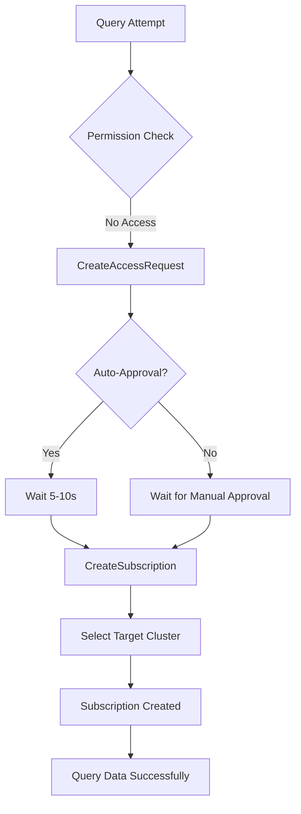

# Andes Subscription Tools Analysis

## Overview
Based on the Andes MCP integration findings, there's a two-step access model for datasets:
1. **CreateAccessRequest** - Grants permission to see the dataset
2. **CreateSubscription** - Actually gives you access to query the data

## The Missing Link
Our current `weblab_request_andes_access` tool only handles the CreateAccessRequest but NOT the subscription. This is why queries fail even after "successful" access requests.

## Andes Subscription Tools

### 1. CreateSubscription
**Purpose**: Subscribe to datasets with various targets (e.g., Redshift clusters)

**Expected Parameters** (based on documentation):
- `datasetId` or `datasetName`: The dataset to subscribe to
- `targetType`: Type of subscription target (e.g., "REDSHIFT", "S3")
- `targetId` or `clusterId`: The specific cluster/target to subscribe to
- `subscriptionName`: Optional name for the subscription
- `refreshSchedule`: Optional refresh schedule for the data

**Workflow**:
1. First, you need CreateAccessRequest approval
2. Then call CreateSubscription to actually get the data
3. The subscription creates a local copy/link in your Redshift cluster

### 2. ReadSubscriptions
**Purpose**: View subscription details and status

**Expected Parameters**:
- `subscriptionId`: Optional - specific subscription to read
- `datasetId`: Optional - filter by dataset
- `status`: Optional - filter by status (ACTIVE, PENDING, FAILED)

**Returns**: List of your current subscriptions with:
- Subscription ID
- Dataset name
- Target cluster
- Status
- Last refresh time

### 3. ReadSubscriptionTargets
**Purpose**: Manage subscription configurations and see available targets

**Expected Parameters**:
- None (lists all available targets)

**Returns**: List of available subscription targets:
- Redshift clusters you have access to
- S3 buckets
- Other data targets

## The Complete Permission Flow



## Implementation Needed

### Update `weblab_request_andes_access.ts` to:

```typescript
// Step 1: Create Access Request
const accessRequest = await createAccessRequest(tableName);

// Step 2: Wait for approval
await waitForApproval(accessRequest.id);

// Step 3: NEW - Create Subscription
const targets = await readSubscriptionTargets();
const subscription = await createSubscription({
  datasetId: tableName,
  targetType: "REDSHIFT",
  targetId: targets[0].id, // Use first available cluster
  subscriptionName: `weblab-${tableName}-subscription`
});

// Step 4: Wait for subscription to activate
await waitForSubscriptionActive(subscription.id);

return {
  status: "success",
  accessRequestId: accessRequest.id,
  subscriptionId: subscription.id,
  message: "Access granted and data subscribed"
};
```

## Testing Strategy

### Without andes-mcp direct access:
1. Use the HTTP bridge approach we've built
2. Add subscription operations to the bridge
3. Test with known auto-approval tables

### Test Cases:
1. **New table, no access**: Full flow (request → approve → subscribe → query)
2. **Existing access, no subscription**: Just subscribe → query
3. **Existing subscription**: Direct query should work

## Key Insights

1. **Why queries fail**: Even with access approval, without a subscription there's no data in your Redshift cluster to query
2. **Subscription targets**: You need to specify WHERE the data should be made available (which Redshift cluster)
3. **Auto vs Manual**: Auto-approval still requires the subscription step

## Next Steps

1. [ ] Add CreateSubscription to HTTP bridge
2. [ ] Add ReadSubscriptionTargets to find available clusters
3. [ ] Update weblab_request_andes_access to include subscription
4. [ ] Test complete flow with real table
5. [ ] Document subscription management

## Questions to Investigate

1. Can we reuse existing subscriptions or need new ones each time?
2. How long do subscriptions stay active?
3. What happens if subscription target changes?
4. Can multiple users share a subscription?

## Reference

From the APM Demo transcript:
> "Subscribe this table to my redshift cluster using data share"

This confirms that subscription is required after access approval to actually query the data.
