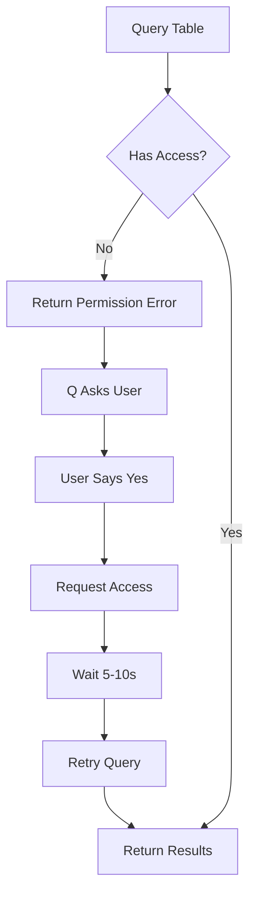

# Complete Permission Request Test Scenario

## Quick Test Mode for Colleagues

To test the permission flow with Q, use this special format:
```
Show me Weblab experiments for user test:encompass-test.fdp-test
```

The `test:` prefix triggers test mode and will query the specified table instead of the default Weblab tables. This allows testing with safe tables that have auto-approval.

## Test Setup

### Prerequisites
1. MCP server running: `cd amazon-internal-mcp-server/src/AmazonInternalMCPServer && npm start`
2. Q CLI ready for testing
3. Log file location: `~/.weblab-mcp/weblab-mcp.log` (default) or `$MCP_LOG_FILE` if set

### How to Monitor Logs
Our logging system (in `src/core/logging/logs.ts`) redirects all DEBUG output to a file:
- **Default location**: `~/.weblab-mcp/weblab-mcp.log`
- **Custom location**: Set `MCP_LOG_FILE` environment variable
- **Real-time monitoring**: `tail -f ~/.weblab-mcp/weblab-mcp.log`

### Test Table
**encompass-test.fdp-test** - Safe test table with auto-approval

## Full Test Scenario with Expected Logs

### Step 1: Initial Query (Will Fail - No Access)

**Q Prompt:**
```
Query the table encompass-test.fdp-test to test permission flow
```

**Expected Logs:**
```
[DEBUG] Starting Weblab experiments query for: encompass-test
[DEBUG] Starting HTTP bridge...
[DEBUG] Bridge path: /path/to/andes-http-bridge.js
[DEBUG] Waiting 3 seconds for bridge to start...
[DEBUG] Checking bridge health...
[DEBUG] Bridge is healthy!
[DEBUG] STEP 1 of 3: Creating connection...
[DEBUG] Connection ID: [UUID]
[DEBUG] STEP 2 of 3: Executing query...
[DEBUG] SQL Query: SELECT * FROM encompass-test.fdp-test
[DEBUG] Error: PERMISSION_DENIED
```

**Expected Q Response:**
```json
{
  "status": "error",
  "error": "PERMISSION_DENIED",
  "message": "You don't have access to this table. Would you like me to request access?"
}
```

### Step 2: Request Access

**User Response:** "Yes, please request access"

**Expected Logs from weblab_request_andes_access:**
```
[DEBUG] Requesting Andes access for table: fdp-test
[DEBUG] User ID: sibagy
[DEBUG] Starting HTTP bridge for access request...
[DEBUG] Waiting for bridge to start...
[DEBUG] Loading Andes context...
[DEBUG] Table is not in WEBLAB_DDL provider, may require manual approval
[DEBUG] Creating access request...
[DEBUG] Access request result: {
  "requestId": "[UUID]",
  "status": "submitted",
  "approvalType": "auto"
}
```

**Expected Q Response:**
```json
{
  "status": "success",
  "message": "Access request submitted for fdp-test. Auto-approval expected - access should be available within 5-10 seconds.",
  "tableName": "fdp-test",
  "userId": "sibagy",
  "requestId": "[UUID]",
  "isAutoApproved": true,
  "approvalType": "auto",
  "estimatedWaitTime": "5-10 seconds"
}
```

### Step 3: Wait for Approval

**Q should automatically:**
- Wait 5-10 seconds
- Show message: "Waiting for permissions to propagate..."

### Step 4: Retry Query (Should Succeed)

**Expected Logs:**
```
[DEBUG] Starting Weblab experiments query for: encompass-test
[DEBUG] Starting HTTP bridge...
[DEBUG] Bridge is healthy!
[DEBUG] STEP 1 of 3: Creating connection...
[DEBUG] Connection ID: [UUID]
[DEBUG] STEP 2 of 3: Executing query...
[DEBUG] SQL Query: SELECT * FROM encompass-test.fdp-test
[DEBUG] Execution ID: [UUID]
[DEBUG] Waiting for query completion...
[DEBUG] Checking query status (attempt 1/10)...
[DEBUG] Query completed successfully!
[DEBUG] STEP 3 of 3: Getting query results...
[DEBUG] Fetching results (attempt 1/5)...
[DEBUG] Successfully retrieved results!
[DEBUG] Raw results text length: [number]
[DEBUG] Parsing results...
[DEBUG] Final results count: [number]
```

**Expected Q Response:**
```json
{
  "status": "success",
  "message": "Successfully queried encompass-test.fdp-test",
  "data": [...],
  "total_count": [number]
}
```

## Validation Checklist

### ✅ Permission Denied Detection
- [ ] Tool correctly identifies permission error
- [ ] Returns proper error message to Q
- [ ] Q asks user if they want to request access

### ✅ Access Request
- [ ] weblab_request_andes_access is called
- [ ] Request includes correct table name
- [ ] Request includes user ID
- [ ] Auto-approval is detected for test tables

### ✅ Approval Wait
- [ ] Q waits appropriate time (5-10 seconds)
- [ ] Shows waiting message to user

### ✅ Successful Retry
- [ ] Query is automatically retried
- [ ] Query succeeds after access granted
- [ ] Results are returned to user

## Debug Log Markers to Watch For

### Success Indicators:
- `[DEBUG] Bridge is healthy!`
- `[DEBUG] Connection ID: [UUID]`
- `[DEBUG] Execution ID: [UUID]`
- `[DEBUG] Query completed successfully!`
- `[DEBUG] Successfully retrieved results!`

### Error Indicators:
- `[DEBUG] Error: PERMISSION_DENIED`
- `[DEBUG] Bridge not ready`
- `[DEBUG] No connection ID found`
- `[DEBUG] Query failed`
- `[DEBUG] Query timeout`

## Troubleshooting

### If permission error not detected:
1. Check if you already have access: Try a different test table
2. Verify table name is correct
3. Check if Andes MCP is properly installed

### If access request fails:
1. Check bridge is running (port 3334)
2. Verify user ID is correct
3. Check Andes context loads successfully

### If retry doesn't work:
1. Wait longer (sometimes takes 15-20 seconds)
2. Check if access was actually granted
3. Verify connection is using correct credentials

## Alternative Test Tables

If encompass-test.fdp-test doesn't work, try:
1. **GOLDKING-TEST-ED-CAIRNS.goldking-test-sample-test**
2. **Sample-Test-Provider.Sample-test**

Both have auto-approval and should work the same way.

## Complete Flow Summary



## Test Commands

### Option 1: Test with Q (logs go to file)
```bash
# Run test
q chat -a "Query the table encompass-test.fdp-test to test permission flow. If I don't have access, please request it for me and retry."

# Check our MCP logs
cat ~/.weblab-mcp/weblab-mcp.log | grep DEBUG

# Or watch logs in real-time while testing
tail -f ~/.weblab-mcp/weblab-mcp.log | grep DEBUG
```

### Option 2: Manual testing to see live logs
```bash
# Terminal 1: Run MCP server manually
cd amazon-internal-mcp-server/src/AmazonInternalMCPServer
npm start 2>&1 | tee debug.log

# Terminal 2: Send test request via Q
q chat -a "Query the table encompass-test.fdp-test to test permission flow"
```

### Option 3: Direct MCP testing (bypass Q)
```bash
# Test directly with MCP protocol
echo '{"jsonrpc": "2.0", "method": "tools/call", "params": {"name": "weblab_user_experiments", "arguments": {"owner": "test-no-access"}}, "id": 1}' | npm start
```

## Validating Results

The flow can be validated by:

1. **Check Q's responses** - Each step should return the expected JSON
2. **Check log file** - All DEBUG output is in `~/.weblab-mcp/weblab-mcp.log`
3. **Verify final success** - If the query works after requesting access, the flow worked!

The complete DEBUG log trail is available in `~/.weblab-mcp/weblab-mcp.log` for post-test validation.
