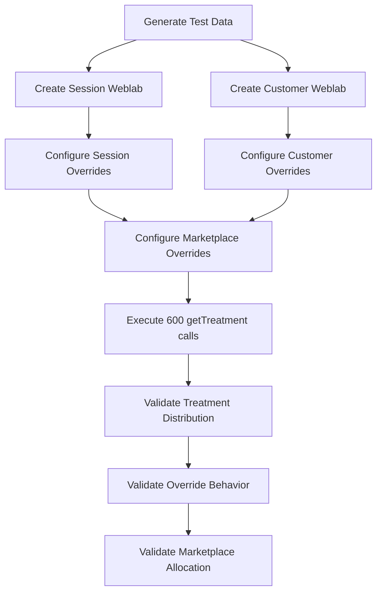

# Weblab UT Design Plan

## Design Overview

Based on conversations with Michael Bower and requirements clarification:

### Core Requirements
- **600+ total calls** to `getTreatment` for each domain (test, pilot and prod)
- **2 weblabs**: session-based and customer-based randomization
- **lots of treatments**: see table below
- **Override treatments**: T6, T7, T9 for deterministic testing
- **DirectedIDs only** (no obfuscated IDs needed)
- **Online weblabs** (no local RODB files)

## Treatment Structure

### Regular Treatment Mapping Table

| Market | Test Domain | Pilot Domain | Prod Domain |
|--------|------------|--------------|-------------|
| US | T1/T2/T3 | T11/T12/T13 | T21/T22/T23 |
| JP | T4 | T14 | T24 |
| GB | T5 | T15 | T25 |
| BR | T6 | T16 | T26 |

**Pattern**: Base treatment for test, +10 for pilot, +20 for prod

### Override Treatment Tables

#### Regular Overrides (Domain-Independent)
| Treatment | Markets | Description |
|-----------|---------|-------------|
| T7 | All (US, JP, GB, BR) | Regular override - works across all marketplaces and domains |
| T8 | All (US, JP, GB, BR) | Regular override - works across all marketplaces and domains |
| T9 | All (US, JP, GB, BR) | Regular override - works across all marketplaces and domains |

#### Mobile Marketplace Overrides (Domain-Based)
| Treatment | Market | Test Domain | Pilot Domain | Prod Domain |
|-----------|--------|-------------|--------------|-------------|
| T28/T38/T48 | CN | T28 | T38 | T48 |
| T29/T39/T49 | FR | T29 | T39 | T49 |
| T30/T40/T50 | DE | T30 | T40 | T50 |
| T31/T41/T51 | CA | T31 | T41 | T51 |

**Pattern**: Base mobile override for test, +10 for pilot, +20 for prod (similar to regular treatments)


## Weblab Structure

### Weblab 1: Session-Based Randomization
- **Name**: `WEBLAB_MOBILE_TESTAPP_SESSION_1299744`
- **Title**: Weblab Mobile Testapp Session
- **Randomization**: Session ID
- **Treatment Structure**:
  - **US**: 33/33/34% allocation (T1/T2/T3)
  - **JP**: 100% allocation (T4)
  - **GB**: 100% allocation (T5)
  - **BR**: 100% allocation (T6)
- **Session ID Pattern**: `000-0000000-0000000` variants

### Weblab 2: Customer-Based Randomization
https://weblab.amazon.com/wl/WEBLAB_MOBILE_TESTAPP_CUSTOMER_1299775
- **Name**: `WEBLAB_MOBILE_TESTAPP_CUSTOMER_1299775`
- **Title**: Weblab Mobile Testapp Customer
- **Randomization**: Customer ID (DirectedID)
- **Treatment Structure**:
  - **US**: 33/33/34% allocation (T1/T2/T3)
  - **JP**: 100% allocation (T4)
  - **GB**: 100% allocation (T5)
  - **BR**: 100% allocation (T6)
- **DirectedID Base**: `amzn1.account.AFJNJ3U34SU22VYNR4CDE5NPAH3A`

## Test Data Generation Strategy

### Session IDs (Coverage for all 18 treatments across domains)
```
US T1/T11/T21: 000-0000000-0000000, 000-0000000-0000001, 000-0000000-0000002, ...
US T2/T12/T22: 000-0000000-0001000, 000-0000000-0001001, 000-0000000-0001002, ...
US T3/T13/T23: 000-0000000-0002000, 000-0000000-0002001, 000-0000000-0002002, ...
JP T4/T14/T24: 000-0000000-0003000, 000-0000000-0003001, 000-0000000-0003002, ...
GB T5/T15/T25: 000-0000000-0004000, 000-0000000-0004001, 000-0000000-0004002, ...
BR T6/T16/T26: 000-0000000-0005000, 000-0000000-0005001, 000-0000000-0005002, ...
```

### DirectedIDs (Coverage for all 18 treatments across domains)
```
US T1/T11/T21: amzn1.account.AFJNJ3U34SU22VYNR4CDE5NPAHTA, ...NPAHTB, ...NPAHTC (A-series)
US T2/T12/T22: amzn1.account.AFJNJ3U34SU22VYNR4CDE5NPAH1A, ...NPAH1B, ...NPAH1C (1-series)
US T3/T13/T23: amzn1.account.AFJNJ3U34SU22VYNR4CDE5NPAH2A, ...NPAH2B, ...NPAH2C (2-series)
JP T4/T14/T24: amzn1.account.AFJNJ3U34SU22VYNR4CDE5NPAH3A, ...NPAH3B, ...NPAH3C (3-series)
GB T5/T15/T25: amzn1.account.AFJNJ3U34SU22VYNR4CDE5NPAH4A, ...NPAH4B, ...NPAH4C (4-series)
BR T6/T16/T26: amzn1.account.AFJNJ3U34SU22VYNR4CDE5NPAH5A, ...NPAH5B, ...NPAH5C (5-series)
```

## Override Configuration

### Treatment Overrides
- **Regular Treatments**: T1, T2, T3 (US), T4 (JP), T5 (GB), T6 (BR)
- **Override Treatments**: T7, T8, T9 for deterministic testing

### Override Test Data
- **3 Session IDs**: Map to override treatments T7, T8, T9
  - `000-0000000-0009000` → T7
  - `000-0000000-0009001` → T8
  - `000-0000000-0009002` → T9
- **3 DirectedIDs**: Map to override treatments T7, T8, T9
  - `amzn1.account.AFJNJ3U34SU22VYNR4CDE5NPAH2A` → T7
  - `amzn1.account.AFJNJ3U34SU22VYNR4CDE5NPAH3A` → T8
  - `amzn1.account.AFJNJ3U34SU22VYNR4CDE5NPAH4A` → T9

## Test Execution Flow



## Validation Points

### Distribution Validation
- **US Market**: Verify ~33/33/34% split across all domains
  - Test: T1/T2/T3, Pilot: T11/T12/T13, Prod: T21/T22/T23
- **JP Market**: Verify 100% allocation per domain
  - Test: T4, Pilot: T14, Prod: T24
- **GB Market**: Verify 100% allocation per domain
  - Test: T5, Pilot: T15, Prod: T25
- **BR Market**: Verify 100% allocation per domain
  - Test: T6, Pilot: T16, Prod: T26
- Allow ±5% variance for randomization

### Override Validation
- **Override IDs**: Specific session/customer IDs return T6, T7, T9
- **Cross-weblab**: Override behavior works for both session and customer weblabs
- **Deterministic**: Same ID always returns same override treatment

### Treatment Coverage Validation
- All 18 regular treatments (T1-T26) are properly allocated across domains
- All 3 override treatments (T6, T7, T9) function correctly
- Domain switching returns correct treatment offsets (+10 pilot, +20 prod)
- No unexpected treatment values returned

## Configuration Parameters

### Weblab Settings
- **Launch vs Experiment**: Launch (no ramp-up needed)
- **Duration**: Permanent (for testing)
- **Marketplace Coverage**: US, JP, GB, BR
- **Platform**: Mobile (iOS/Android)

### Treatment Definitions
**Test Domain (Base):**
- **T1-T3**: US market (33/33/34% split)
- **T4**: JP market (100%)
- **T5**: GB market (100%)
- **T6**: BR market (100%)

**Pilot Domain (+10):**
- **T11-T13**: US market (33/33/34% split)
- **T14**: JP market (100%)
- **T15**: GB market (100%)
- **T16**: BR market (100%)

**Prod Domain (+20):**
- **T21-T23**: US market (33/33/34% split)
- **T24**: JP market (100%)
- **T25**: GB market (100%)
- **T26**: BR market (100%)

**Override Treatments:**
- **T6, T7, T9**: Deterministic testing (work across all domains)

## Implementation Steps

1. Create session-based weblab with 33/33/34 allocation
2. Create customer-based weblab with 33/33/34 allocation  
3. Generate 600 session IDs and 600 DirectedIDs following patterns
4. Configure overrides for deterministic testing
5. Set up marketplace mobile overrides (JP→T1, GB→T2, BR→T3)
6. Implement test harness calling getTreatment 600 times
7. Add validation logic for distribution and override behavior
8. Verify marketplace allocation works correctly

# Validations
overrides can be validated by looking at the file we can download from an URL similar to this one:
```
https://m.media-amazon.com/images/S/mobile-weblab-allocation-overrides-gamma/permanent/overrides/v1/amzn1.account.AFJNJ3U34SU22VYNR4CDE5NPAH3A?app_id=com_amazon_weblab_testapp_newclient_NewClient1


.schema
version,v1
.metadata
visitorIDType,DIRECTED_CUSTOMER
visitorID,amzn1.account.AFJNJ3U34SU22VYNR4CDE5NPAH3A
.overrides
1083107_BBXP,2
140447_GTZM,3
522952_FCNS,4
```

For instance, replace `AFJNJ3U34SU22VYNR4CDE5NPAH3A` with the 7A we are using: 
```
https://m.media-amazon.com/images/S/mobile-weblab-allocation-overrides-gamma/permanent/overrides/v1/amzn1.account.AFJNJ3U34SU22VYNR4CDE5NPAH2A?app_id=com_amazon_weblab_testapp_newclient_NewClient1

.schema
version,v1
.metadata
visitorIDType,DIRECTED_CUSTOMER
visitorID,amzn1.account.AFJNJ3U34SU22VYNR4CDE5NPAH2A
.overrides
1299775_ZLDL,7
```
